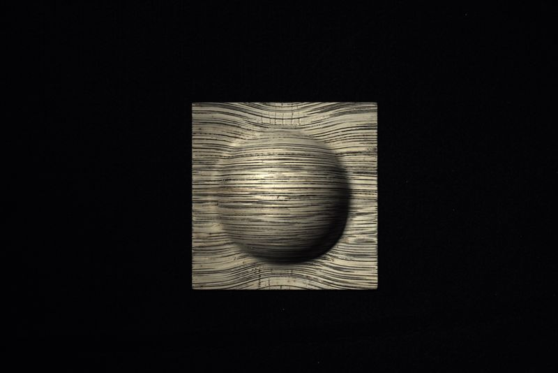
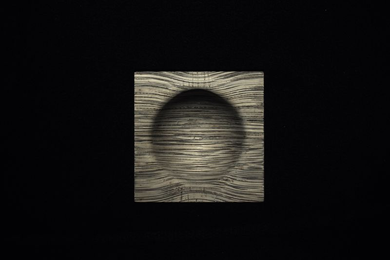

# Material Scanner

## Live Demo in Web Browser

https://yertleturtlegit.github.io/material-scanner/

## Run on nearly every Local Maschine in Web Browser

1. Clone the repository recursively:

   ```bash
   git clone --recursive https://github.com/YertleTurtleGit/material-scanner
   ```

2. Open your preferred web browser and open the
   ['index.html'](index.html) file.

## Code Editing and Building on Local Maschine

0. You need to have Visual Studio Code
   (code.visualstudio.com) with TypeScript
   (www.typescriptlang.org) support installed on your
   maschine to edit and build the code. You can use the
   following guide:
   code.visualstudio.com/Docs/languages/typescript

1. Clone the repository recursively:

   ```bash
   git clone --recursive https://github.com/YertleTurtleGit/material-scanner
   ```

2. Open
   ['spherical-scanner.code-workspace'](spherical-scanner.code-workspace)
   as workspace in Visual Studio Code.

3. Run the configured build on file change task by clicking
   ctrl+shift+b.

4. Press F5 to run the application in the chromium web
   browser. You may have to configure the
   ['launch.json'](.vscode/launch.json) file to fit your
   setup. Alternatively you can open your preferred web
   browser and open the ['index.html'](index.html) file.

## Test-Dataset

The following test-dataset is used:

<div align="center">
    
    
    
    
    
    
    
    
</div>
