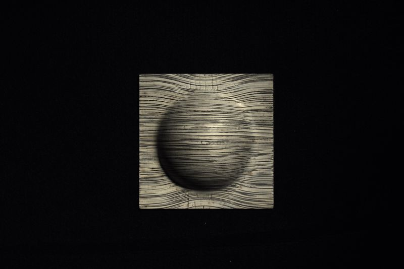

# Material Scanner

Live demo: https://yertleturtlegit.github.io/material-scanner/

## Test-Dataset

The following test-dataset is used:

    
    
    
    
    
    
    
    

## Normal Mapping

    
    
     
    
Point cloud with mapped normals as vertex color.

## Error-Proneness Mapping

An error-proneness calculated on the basis of the difference
between opposite _Riemann sums_ is color-coded relatively
per point cloud.

    
    
     
    
Point cloud with mapped error-proneness as vertex color. Green symbolizes low and red symbolizes high error-proneness.

